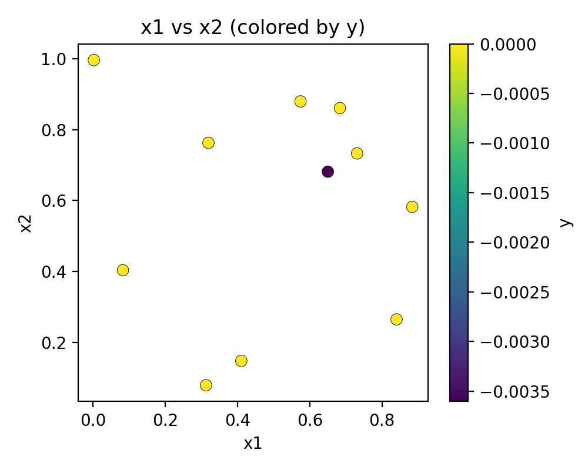
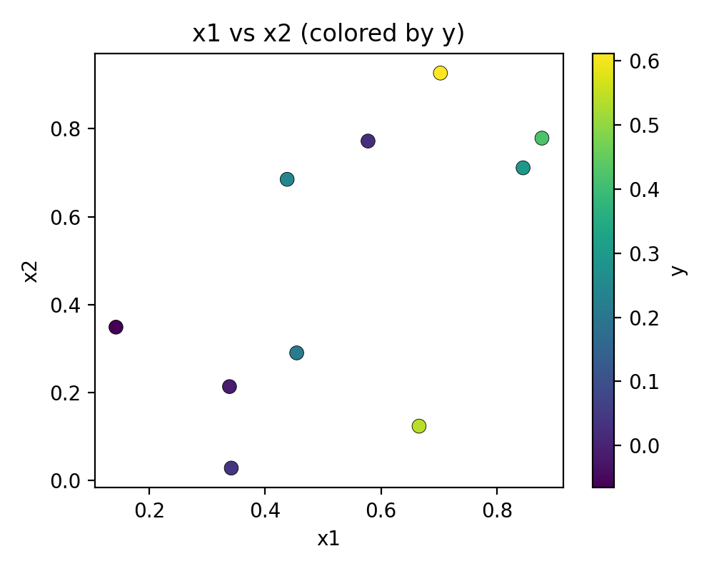
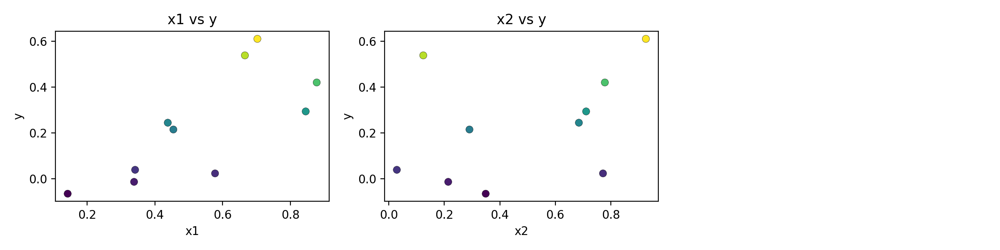
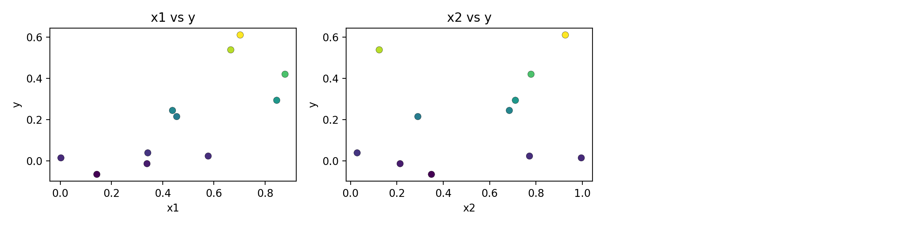
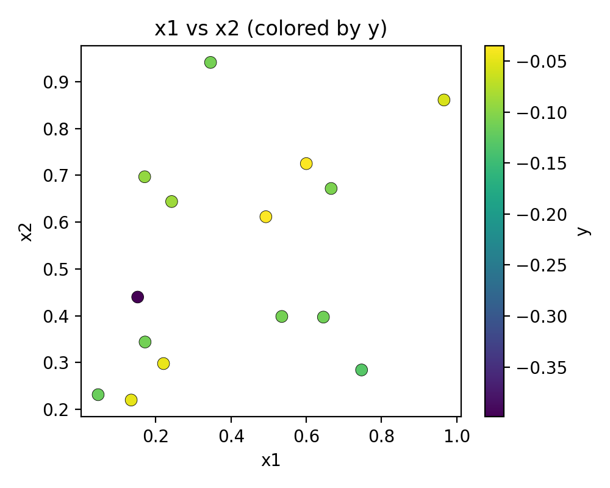
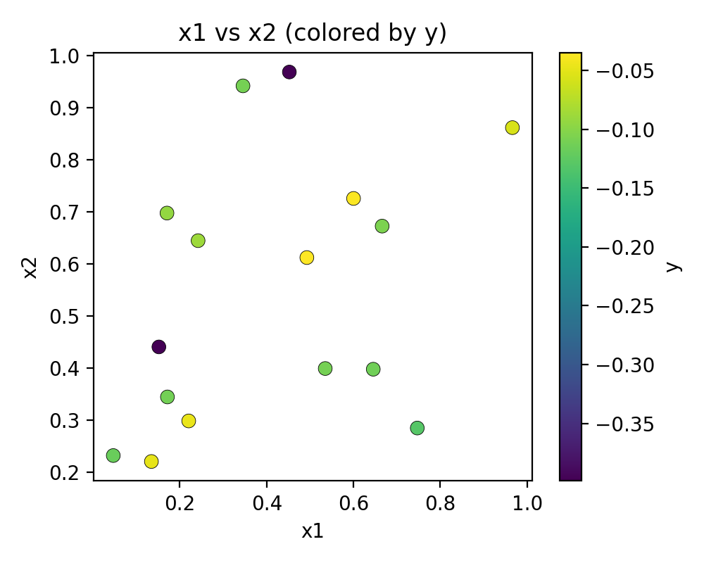
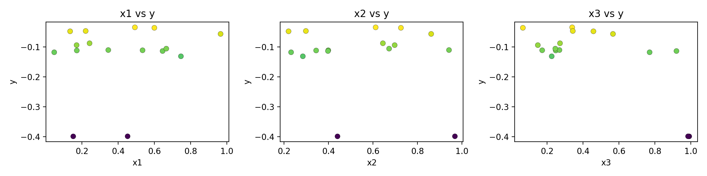
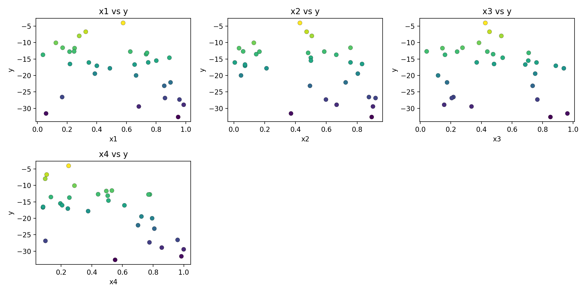
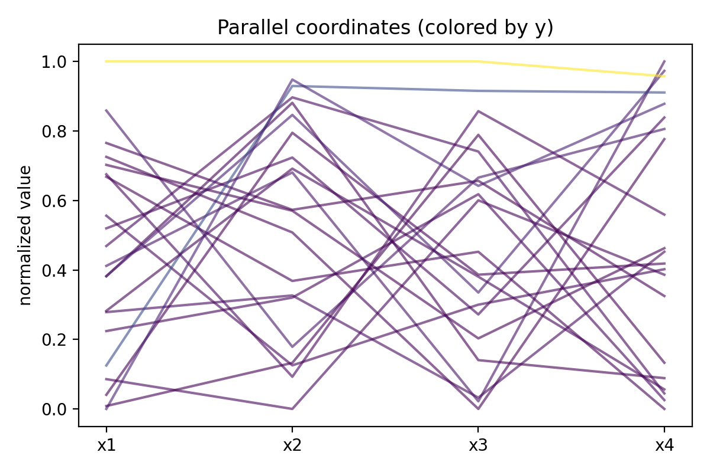
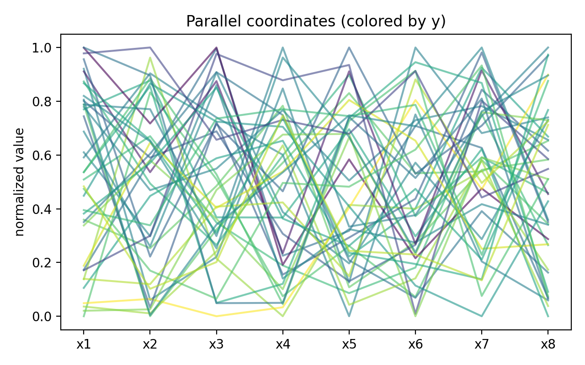

# Round 01 Pre/Post Plot Summary

This file is intended for the VS Code "Markdown PDF" extension to export a single PDF.
Open this file, then run the extension's "Export (pdf)" command.

## Function 1

### x1 vs x2 (colored by y)

Pre  

Post  

### Dimension vs y

Pre  

Post  

## Function 2

### x1 vs x2 (colored by y)

Pre  

Post  

### Dimension vs y

Pre  

Post  

## Function 3

### x1 vs x2 (colored by y)

Pre  

Post  

### Dimension vs y

Pre  

Post  

## Function 4

### Dimension vs y

Pre  

Post  

### Parallel coordinates

Pre  

Post  

## Function 5

### Dimension vs y

Pre  

Post  

### Parallel coordinates

Pre  

Post  

## Function 6

### Dimension vs y

Pre  

Post  

### Parallel coordinates

Pre  

Post  

## Function 7

### Dimension vs y

Pre  

Post  

### Parallel coordinates

Pre  

Post  

## Function 8

### Dimension vs y

Pre  

Post  

### Parallel coordinates

Pre  

Post  

